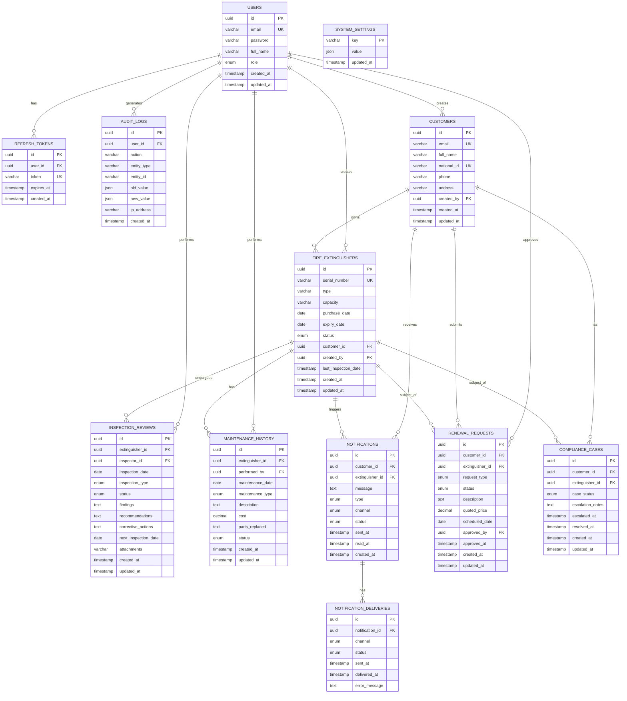
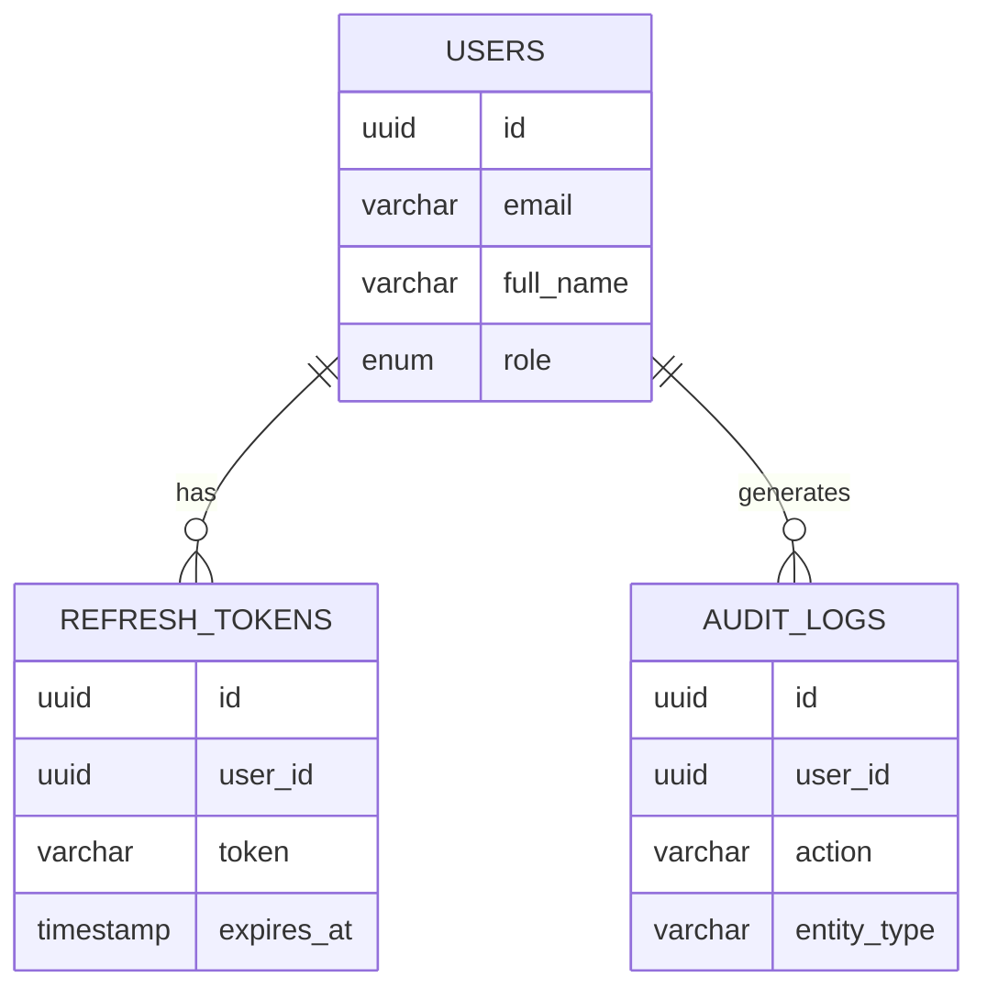
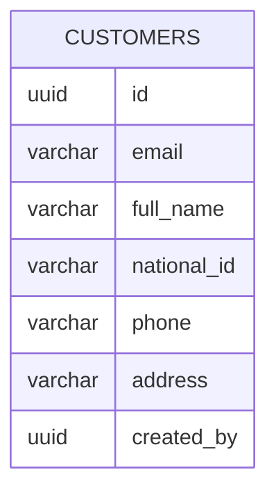
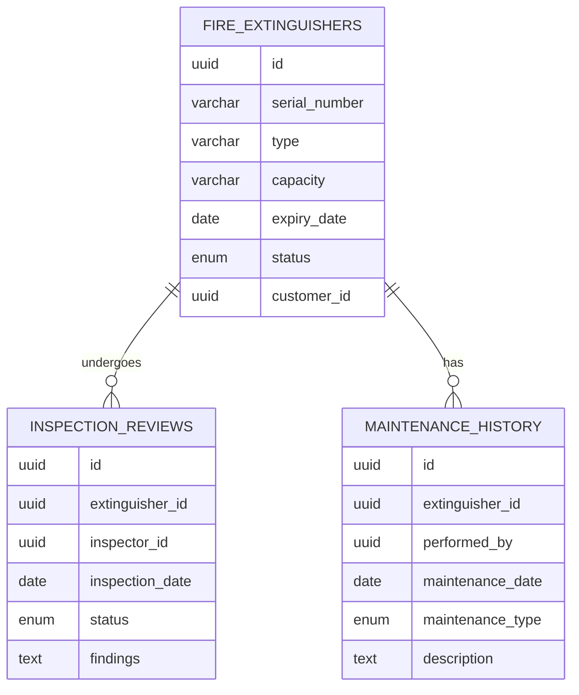
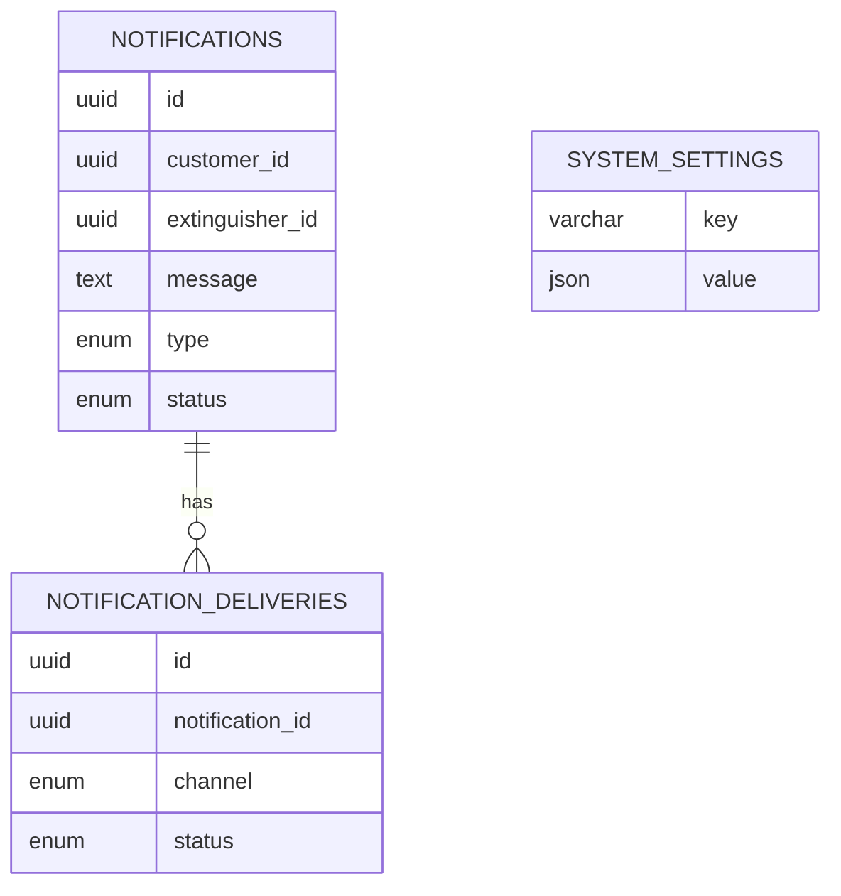
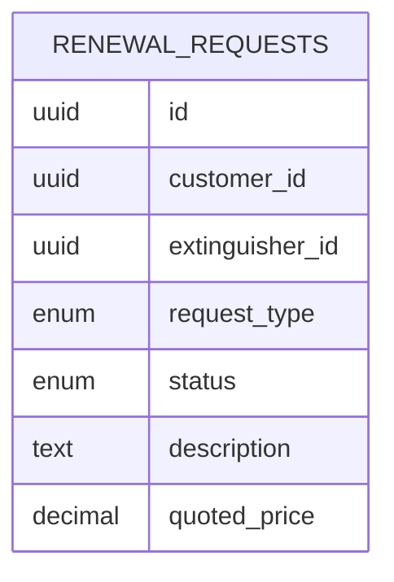
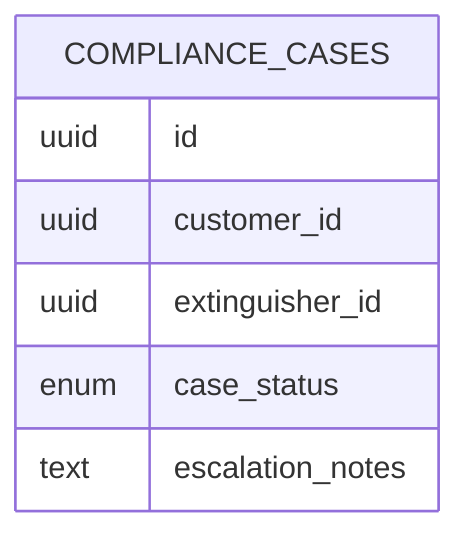

# FEMS Database Diagram (Mermaid)

## Complete Entity Relationship Diagram

## Simplified View by Database

### 1. Auth Database (fems_auth)

### 2. Customer Database (fems_customers)

### 3. Extinguisher Database (fems_extinguishers)

### 4. Notification Database (fems_notifications)

### 5. Renewal Database (fems_renewals)

### 6. Compliance Database (fems_compliance)

## Key Points

### Logical Links (Cross-Database)
- `customers.email` ↔ `users.email` (resolved at runtime)
- `fire_extinguishers.customer_id` → references `customers.id`
- `notifications.customer_id` → references `customers.id`
- `renewal_requests.customer_id` → references `customers.id`
- `compliance_cases.customer_id` → references `customers.id`

### User Roles
- **Admin**: Full system access
- **Customer**: Limited to own records
- **Inspector** (future): Can perform inspections

### Status Enums
- **Extinguisher Status**: ACTIVE, EXPIRING_SOON, EXPIRED, UNDER_MAINTENANCE
- **Inspection Status**: PENDING, APPROVED, REJECTED, REQUIRES_ACTION
- **Maintenance Type**: ROUTINE, REPAIR, REFILL, REPLACEMENT
- **Request Type**: SERVICE, REPLACEMENT
- **Case Status**: OPEN, ESCALATED, RESOLVED, CLOSED
