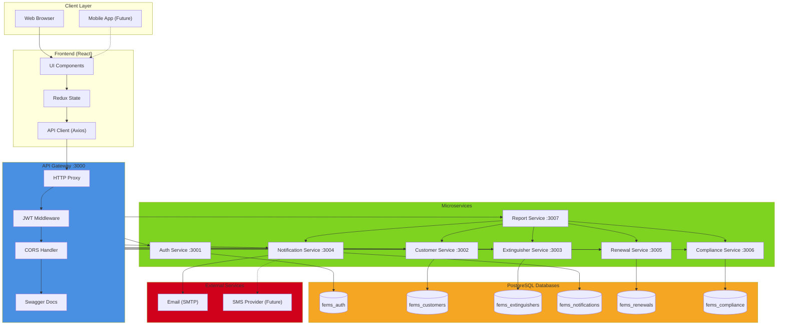
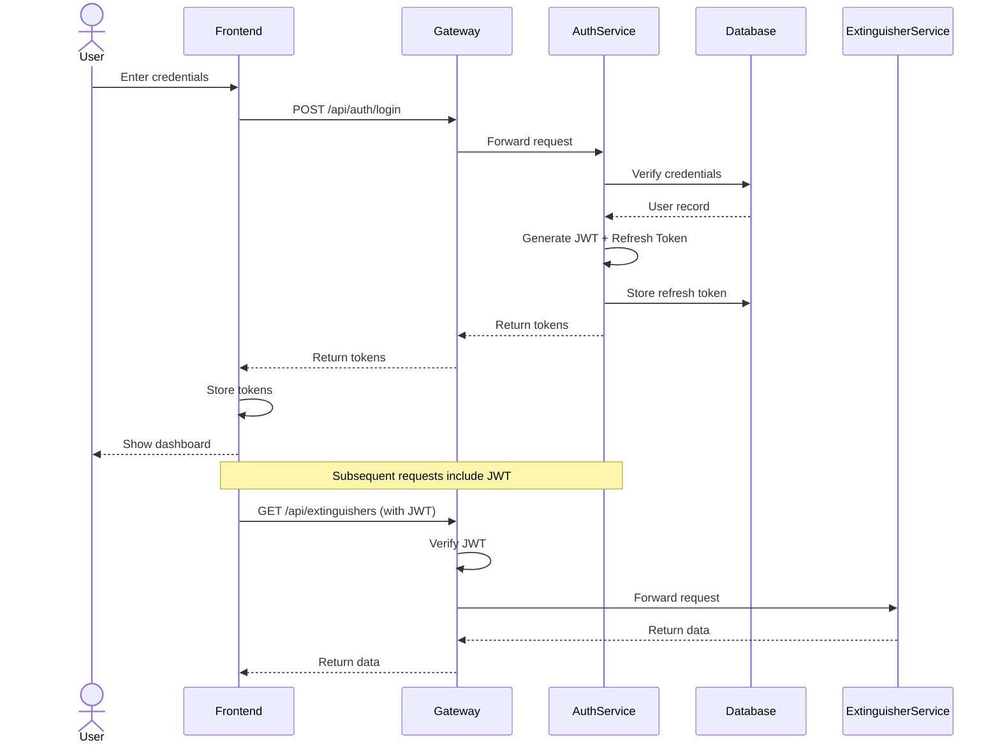
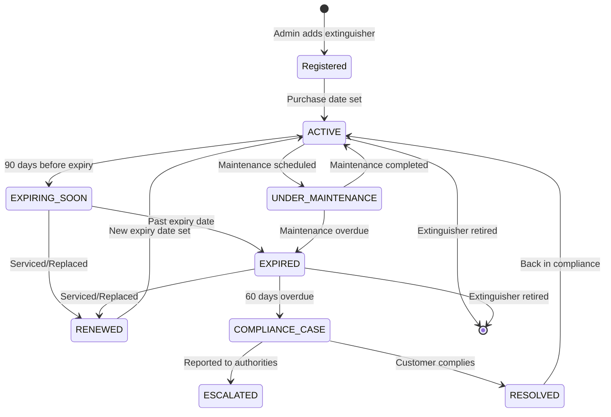
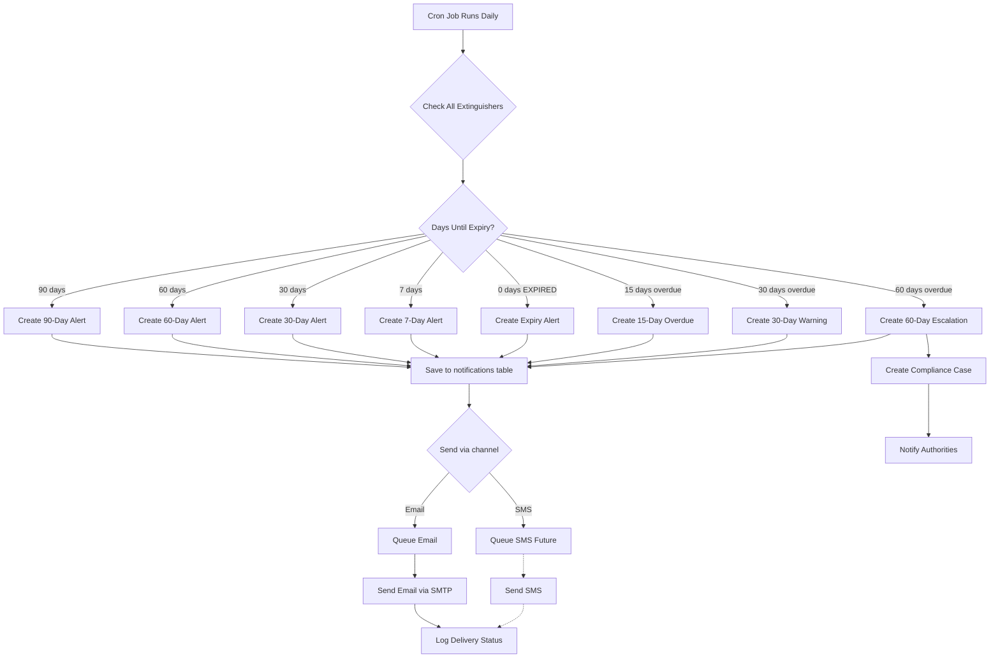
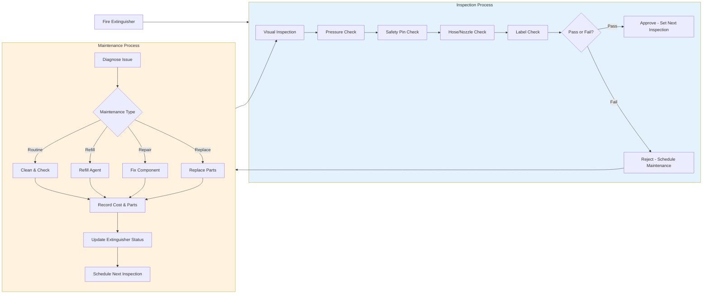
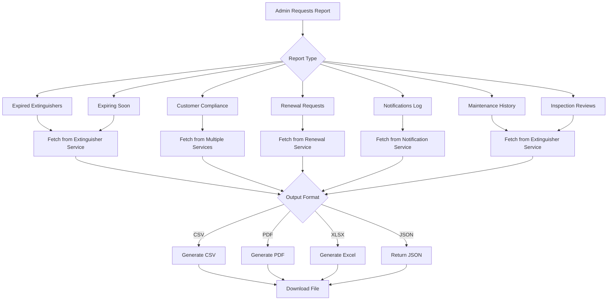
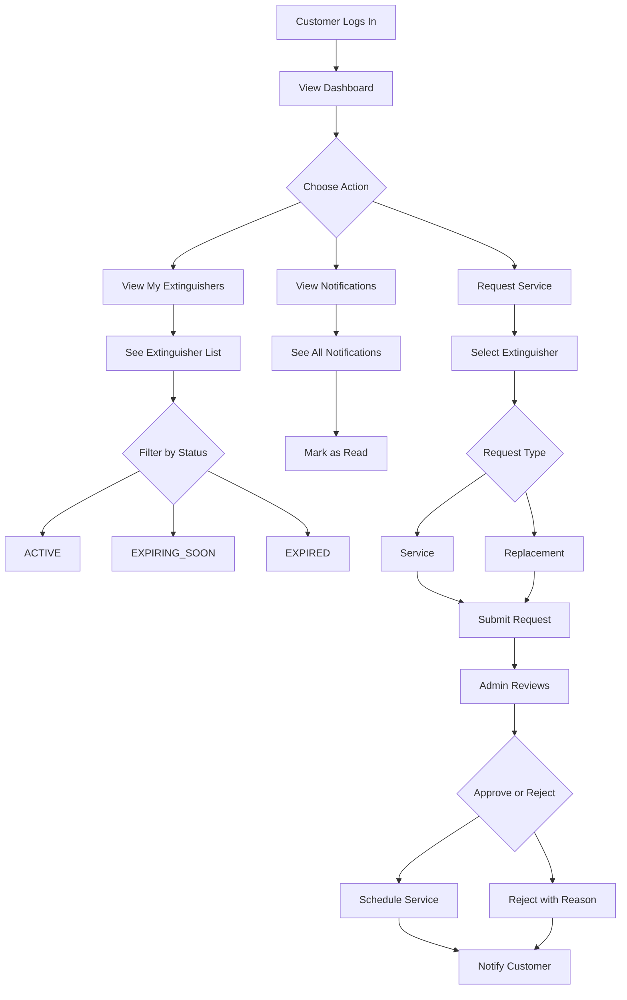
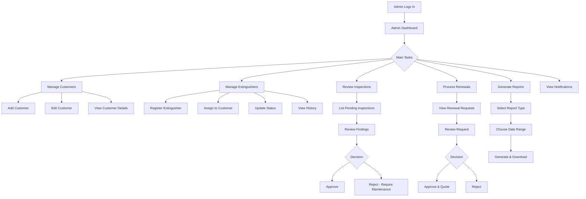
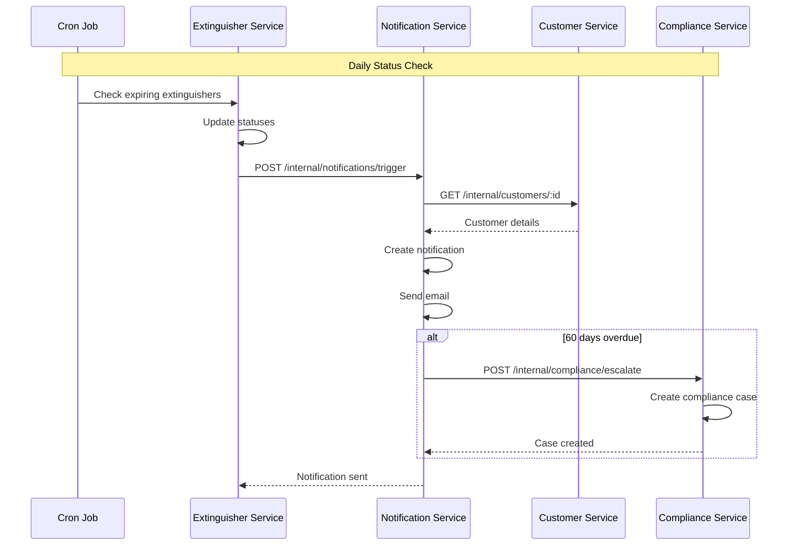

# FEMS System Flow Diagrams

## 1. Overall System Architecture

## 2. User Authentication Flow

## 3. Fire Extinguisher Lifecycle

## 4. Notification Flow

## 5. Inspection vs Maintenance Process

## 6. Report Generation Flow

## 7. Customer Self-Service Flow

## 8. Admin Workflow

## 9. Service-to-Service Communication

## Key Differences: Inspection vs Maintenance

### **Inspection Reviews**
- **Purpose**: Safety verification, compliance check
- **Performed by**: Inspector (can be internal staff or external)
- **Frequency**: Regular intervals (monthly, quarterly, annually)
- **Result**: Pass/Fail status, recommendations
- **Action**: Approve for continued use OR flag for maintenance
- **Records**: Findings, photos, next inspection date

### **Maintenance History**
- **Purpose**: Repair, service, refill, or replace
- **Performed by**: Technician or service provider
- **Trigger**: Failed inspection, scheduled service, or customer request
- **Result**: Extinguisher restored to working condition
- **Action**: Physical work done, parts replaced, agent refilled
- **Records**: Cost, parts used, work description, status update

### **Simple Analogy**
- **Inspection** = Doctor's checkup (looking for problems)
- **Maintenance** = Medical treatment (fixing problems)
