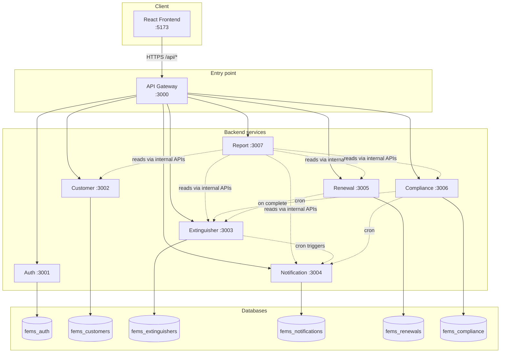
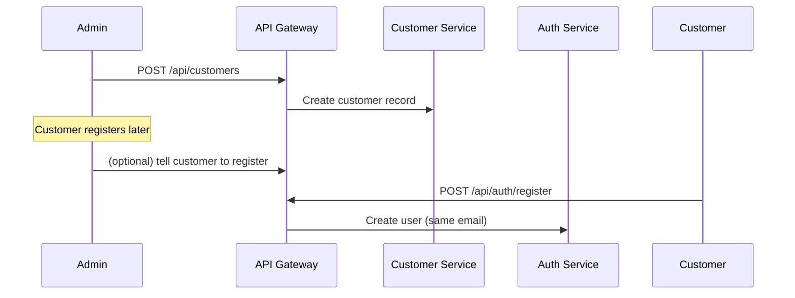

# Fire Extinguisher Management System (FEMS) — System Guide

This guide explains **what the system does**, **how the pieces fit together**, and **how data moves** through it. It is written for someone seeing the project for the first time.

---

## 1. What problem does this solve?

FEMS helps a company manage **fire extinguishers** for many **customers**. For each extinguisher it tracks:

- Serial number, type, capacity, purchase date, **expiry date**
- **Status** (active, expiring soon, expired, renewed)
- **Alerts** before and when extinguishers expire
- **Renewal requests** (service, replacement, inspection)
- **Compliance cases** when regulatory follow-up is needed
- **Reports** for admins (dashboard, PDF, Excel, CSV)

There are two kinds of users:

| Role | Who they are | What they do |
|------|----------------|---------------|
| **Admin** | Internal staff | Manage all customers, extinguishers, renewals, compliance, reports, settings |
| **Customer** | Building owner / client | See their own extinguishers and notifications, submit renewal requests |

---

## 2. Big picture: how is it built?

The system is a **microservices** application: many small backend apps, each with its own job, talking over HTTP. A **single entry point** (API Gateway) is what the browser and tools call.



**Important idea:** The frontend never talks to ports 3001–3007 directly. It only talks to **`http://localhost:3000/api`**. The gateway forwards each path to the right service.

---

## 3. What happens when you click something in the UI?

Example: customer opens “My extinguishers”.

1. **React app** sends `GET /api/extinguishers/mine` with header `Authorization: Bearer <access token>`.
2. **API Gateway** (port 3000) sees `/api/extinguishers` and proxies the request to **extinguisher-service** (port 3003).
3. **Extinguisher service** validates the JWT, reads the user’s **email** from the token, calls **customer-service** internally: “give me the customer record for this email”.
4. It queries **fems_extinguishers** for rows where `customer_id` matches.
5. JSON comes back through the gateway to the browser.

```text
Browser → Gateway → Extinguisher → (internal) Customer → PostgreSQL
                ↑ JWT checked on Extinguisher service
```

Same pattern for login, notifications, renewals, etc.—only the target service changes.

---

## 4. The eight backend pieces (plain English)

| Service | Port | Database | Responsibility |
|---------|------|----------|----------------|
| **api-gateway** | 3000 | None | Routes `/api/*` to the right service; merged Swagger at `/api/docs` |
| **auth-service** | 3001 | `fems_auth` | Login, register, JWT, refresh tokens, users, audit logs |
| **customer-service** | 3002 | `fems_customers` | Customer profiles (name, phone, email, address) |
| **extinguisher-service** | 3003 | `fems_extinguishers` | Fire extinguisher inventory + **daily cron** for status & alerts |
| **notification-service** | 3004 | `fems_notifications` | Stores notifications, sends email (SMS-ready), settings |
| **renewal-service** | 3005 | `fems_renewals` | Customer renewal requests; admin approve/reject/complete |
| **compliance-service** | 3006 | `fems_compliance` | Compliance cases & escalation |
| **report-service** | 3007 | None | Pulls data from other services and builds reports/exports |

Shared code lives in **`packages/shared`** (`@fems/shared`): JWT guards, roles, pagination, TypeORM config, service-to-service auth guard.

---

## 5. How users and customers are linked (critical for newcomers)

There are **two separate “person” records**:

- **`users`** (in `fems_auth`) — login account: email, password, role (`admin` or `customer`)
- **`customers`** (in `fems_customers`) — business record: name, phone, national ID, address

They are **not** linked by a foreign key across databases. They are linked by **matching email**:

1. Admin creates a **customer** with email `alice@example.com`.
2. Alice **registers** with the same email → a **user** row is created.
3. When Alice calls “my extinguishers”, services resolve her `customer_id` via:

   `GET /internal/customers/by-email/:email` (service-to-service only).

If emails do not match, the customer can log in but may get “profile not found” on customer-scoped endpoints.

---

## 6. Authentication (how login works)

### Register / login

- Passwords are hashed with **bcrypt** (cost 12).
- On success you get:
  - **Access token** (JWT, short-lived, ~15 minutes) — sent on every API call.
  - **Refresh token** (longer, ~7 days) — stored hashed in DB; used only to get new access tokens.

### Refresh rotation

When the access token expires, the frontend calls `POST /api/auth/refresh`. The old refresh token is **revoked** and a **new pair** is issued. That limits damage if a refresh token leaks.

### Roles (RBAC)

- Endpoints are protected with `JwtAuthGuard` + `RolesGuard`.
- `@Roles('admin')` vs customer-only routes like `/extinguishers/mine`, `/notifications/me`.

### Service-to-service calls

Microservices call each other on **`/internal/...`** paths with header:

```http
X-Service-Key: <SERVICE_INTERNAL_KEY>
```

Same secret in every service `.env`. Browsers and normal users never use these routes.

---

## 7. Fire extinguisher lifecycle

### Status (computed from expiry date)

Logic in extinguisher-service:

| Condition | Status |
|-----------|--------|
| Expiry date is in the past | `EXPIRED` |
| Expiry within 90 days (still in future) | `EXPIRING_SOON` |
| Otherwise | `ACTIVE` |
| After admin completes a renewal | `RENEWED` (and new expiry date set) |

Status is recalculated when you create/update an extinguisher and again every night by cron.

### Pre-expiry notifications (automated)

Every day at **midnight**, extinguisher-service runs a job that:

1. Loads all extinguishers.
2. Updates status if it changed.
3. For each extinguisher, checks **days until expiry**. If it equals exactly **90, 60, 30, 7, or 0**, it calls notification-service:

   `POST /internal/notifications/trigger`

Notification-service creates a record **once per (type + extinguisher + customer)** (idempotent), logs delivery, and can send email.

### Post-expiry / compliance (partially automated)

The **design** includes post-expiry reminders (`REMINDER_15`, `REMINDER_30`, `WARNING`) and compliance stages (`OPEN` → `WARNING_SENT` → `FINAL_WARNING` → `ESCALATED`).

**What runs today:**

- **Compliance cron** (7:00 AM): finds extinguishers expiring within 60 days, opens/updates compliance cases, sends an `EXPIRY_60` style notification.
- **Settings** store default escalation rules (e.g. warn at 60/75/90 days) and notification schedules—the extinguisher cron still uses **fixed** thresholds `[90, 60, 30, 7, 0]` in code.
- Post-expiry day 15 / 30 / 60 workflows from the README are **modeled in enums/settings** but **not fully wired** in cron yet.

Good to know as a newcomer: README describes the **target** behavior; cron code is the **current** behavior.

---

## 8. Main business workflows

### A. Onboarding a new customer (admin flow)



### B. Admin adds an extinguisher

1. `POST /api/extinguishers` with `customerId`, serial number, expiry date, etc.
2. Status is computed immediately.
3. Alerts for 90/60/30/7/0 days fire on the **calendar day** when `daysUntilExpiry` matches (via nightly cron), not at create time unless that day happens to match.

### C. Customer submits a renewal

1. Customer: `POST /api/renewals` (linked to their customer id via email).
2. Status: `PENDING`.
3. Admin: `PATCH .../approve` → `APPROVED`.
4. Admin: `PATCH .../complete` with `newExpiryDate` → renewal-service calls extinguisher-service internally to **renew** the unit → status `RENEWED`, new expiry stored.

### D. Customer reads notifications

1. `GET /api/notifications/me`
2. Notification-service resolves customer by JWT email, filters by `customer_id`.
3. `PATCH /api/notifications/:id/read` marks one as read.

### E. Admin reports

Report-service has **no database**. It calls internal report endpoints on other services, then:

- Returns JSON for dashboard (`/api/reports/dashboard-summary`)
- Or exports PDF / XLSX / CSV for list reports

---

## 9. Scheduled background jobs

| Time | Service | What it does |
|------|---------|----------------|
| 00:00 daily | extinguisher-service | Update statuses; trigger 90/60/30/7/0-day notifications |
| 06:00 daily | notification-service | Retry/process pending email deliveries |
| 07:00 daily | compliance-service | Scan expiring-within-60-days; escalate cases + notify |

These use `@nestjs/schedule` and only run while that service process is up.

---

## 10. API Gateway routing (cheat sheet)

| URL prefix | Forwarded to |
|------------|----------------|
| `/api/auth`, `/api/users` | auth-service (3001) |
| `/api/customers` | customer-service (3002) |
| `/api/extinguishers` | extinguisher-service (3003) |
| `/api/notifications`, `/api/settings` | notification-service (3004) |
| `/api/renewals` | renewal-service (3005) |
| `/api/compliance` | compliance-service (3006) |
| `/api/reports` | report-service (3007) |

Gateway-only: `/api`, `/api/health`, `/api/docs`.

Interactive API list: **http://localhost:3000/api/docs**

---

## 11. Frontend (React)

- **Stack:** React 19, Vite, Tailwind, Redux Toolkit, Axios.
- **Base URL:** `VITE_API_URL` (default `/api`, often proxied to gateway).
- **Auth:** Tokens in storage; Axios interceptor refreshes on 401, then retries the request.
- **Routes:**
  - Public: `/login`, `/register`
  - All logged-in users: dashboard, extinguishers, notifications, renewals
  - Admin only: customers, compliance, reports, settings

Demo logins (after `npm run seed`):

| Role | Email | Password |
|------|-------|----------|
| Admin | admin@fems.local | Admin@123 |
| Customer | alice@example.com | Customer@123 |

---

## 12. How to run the system locally (minimal path)

1. **PostgreSQL** — create DBs: `psql ... -f scripts/init-databases.sql`
2. **Copy `.env` files** from each `*.env.example` (gateway + 7 services + frontend).
3. **Install:** `npm install` and `cd frontend && npm install`
4. **Start backends:** `npm run dev:services` (builds shared package, starts all 8 processes).
5. **Seed data** (second terminal, after tables exist): `npm run seed`
6. **Smoke test APIs:** `npm run test:apis`
7. **Frontend:** `cd frontend && npm run dev` → http://localhost:5173

If a port is busy: `npm run stop:services` then start again.

---

## 13. Project layout (where to look in code)

```text
FireExtinguisherManagement/
├── packages/shared/          # Shared guards, DTOs, bootstrap
├── services/
│   ├── api-gateway/          # Proxy + Swagger merge
│   ├── auth-service/
│   ├── customer-service/
│   ├── extinguisher-service/ # Cron + inventory
│   ├── notification-service/
│   ├── renewal-service/
│   ├── compliance-service/
│   └── report-service/
├── frontend/src/             # Pages, Redux slices, API services
├── scripts/                  # init-databases.sql, seed.mjs, test-apis.mjs
└── docs/                     # Architecture, API, deployment, this guide
```

**Good first files to read:**

| Topic | File |
|-------|------|
| Gateway routing | `services/api-gateway/src/main.ts` |
| Extinguisher status + cron | `services/extinguisher-service/src/extinguishers/services/extinguishers.service.ts`, `extinguisher-cron.service.ts` |
| Notification creation | `services/notification-service/src/notifications/notification-engine.service.ts` |
| Renewal completion | `services/renewal-service/src/renewals/services/renewals.service.ts` |
| Frontend API + auth | `frontend/src/services/apiClient.ts` |

---

## 14. Data stores (one sentence each)

| Database | Main tables | Purpose |
|----------|-------------|---------|
| `fems_auth` | users, refresh_tokens, audit_logs | Login & security |
| `fems_customers` | customers | Who owns extinguishers |
| `fems_extinguishers` | fire_extinguishers | Inventory |
| `fems_notifications` | notifications, notification_deliveries, system_settings | Alerts & config |
| `fems_renewals` | renewal_requests | Service requests |
| `fems_compliance` | compliance_cases | Regulatory escalation |

In development, TypeORM **`synchronize: true`** creates/updates tables when a service starts. **`npm run seed`** fills demo rows.

---

## 15. Mental model summary

1. **One front door** — API Gateway on port 3000.
2. **Each service owns its data** — no cross-DB joins; link users ↔ customers by **email**.
3. **JWT for people**, **service key for machines**.
4. **Extinguisher service drives expiry logic** and asks notification-service to alert.
5. **Renewal completion updates the extinguisher** via internal API.
6. **Report service is read-only aggregation** across services.
7. **Cron jobs need services running** — they are not separate workers in this repo.

---

## 16. Related documentation

| Document | Description |
|----------|-------------|
| [ARCHITECTURE.md](./ARCHITECTURE.md) | Technical architecture |
| [DATABASE_DESIGN.md](./DATABASE_DESIGN.md) | Table columns |
| [API.md](./API.md) | Endpoint list |
| [DEPLOYMENT.md](./DEPLOYMENT.md) | Deployment guide |
| [../README.md](../README.md) | Setup, Docker, testing |

---

## License

Proprietary — Fire Extinguisher Management System
